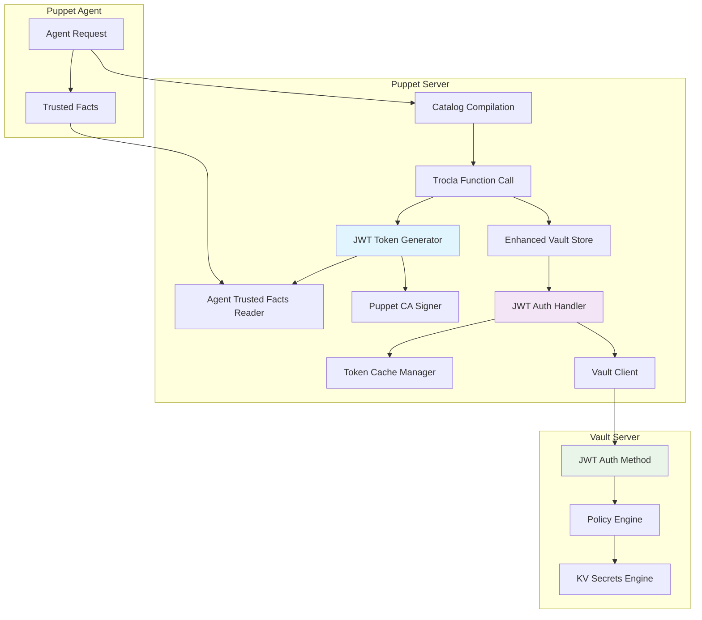
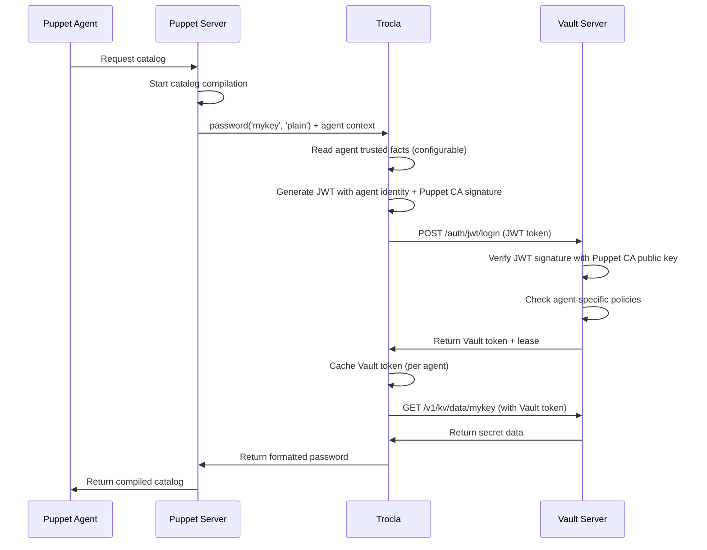

# Plan d'implémentation : Authentification JWT dynamique pour Trocla avec Vault

## 🎯 Objectif

Faire évoluer le store Vault de trocla pour supporter une authentification JWT dynamique basée sur des trusted facts configurables de l'agent Puppet, avec des tokens signés par la CA Puppet et valides pendant toute la durée de compilation du catalogue sur le Puppet Server.

## 📋 Contexte et architecture actuelle

### Architecture Puppet
- **Puppet Server** : Exécute trocla pendant la compilation des catalogues
- **Puppet Agent** : Demande un catalogue au Puppet Server
- **Trusted Facts** : Disponibles sur le Puppet Server pour l'agent en cours de compilation

### Code trocla existant
- Store Vault fonctionnel : `lib/trocla/stores/vault.rb`
- Authentification actuelle : Token statique via `Vault::Client.new(config)`
- Configuration : `store_options` dans `/etc/troclarc.yaml`
- Architecture pluggable : `Trocla::Stores`

## 🏗️ Architecture proposée



## 🔄 Flux d'authentification



## 📝 Plan d'implémentation détaillé

### Phase 1 : Extension du Store Vault existant

#### 1.1 Nouveau store `vault_jwt`
**Fichier** : `lib/trocla/stores/vault_jwt.rb`

```ruby
class Trocla::Stores::VaultJwt < Trocla::Stores::Vault
  # Hérite de toutes les fonctionnalités du store vault
  # Ajoute la gestion JWT
end
```

**Fonctionnalités** :
- Hérite du store vault existant
- Surcharge l'initialisation pour gérer JWT
- Gestion du contexte agent (trusted facts)

#### 1.2 Gestionnaire des trusted facts
**Fichier** : `lib/trocla/util/trusted_facts.rb`

```ruby
module Trocla::Util::TrustedFacts
  def self.get_agent_fact(fact_name, agent_context)
    # Lecture des trusted facts de l'agent en cours de compilation
  end
end
```

**Fonctionnalités** :
- Lecture des trusted facts depuis le contexte Puppet
- Support des facts configurables
- Gestion des erreurs si le fact n'existe pas

#### 1.3 Générateur JWT
**Fichier** : `lib/trocla/util/jwt_generator.rb`

```ruby
module Trocla::Util::JwtGenerator
  def self.generate(claims, ca_key_path)
    # Génération JWT signé par la CA Puppet
  end
end
```

**Fonctionnalités** :
- Signature avec la clé privée Puppet CA
- Claims configurables basés sur les trusted facts
- Support des algorithmes RS256/ES256

### Phase 2 : Authentification JWT avec Vault

#### 2.1 Gestionnaire d'authentification JWT
**Fichier** : `lib/trocla/vault/jwt_auth.rb`

```ruby
class Trocla::Vault::JwtAuth
  def authenticate(agent_context, config)
    # Génération du token JWT pour l'agent
    # Authentification auprès de Vault
    # Retour du token Vault
  end
end
```

**Fonctionnalités** :
- Génération du token JWT par agent
- Authentification auprès de Vault via l'auth method JWT
- Gestion du renouvellement de token
- Gestion des erreurs d'authentification

#### 2.2 Cache de tokens par agent
**Fichier** : `lib/trocla/vault/token_cache.rb`

```ruby
class Trocla::Vault::TokenCache
  # Cache thread-safe des tokens Vault par agent
  def get_token(agent_id)
  def set_token(agent_id, token, ttl)
  def invalidate_token(agent_id)
end
```

**Fonctionnalités** :
- Cache en mémoire des tokens Vault par agent
- Expiration automatique basée sur le TTL
- Thread-safe pour les environnements multi-threaded Puppet Server
- Nettoyage automatique des tokens expirés

### Phase 3 : Intégration avec le contexte Puppet

#### 3.1 Récupération du contexte agent
**Modification** : `lib/trocla/stores/vault_jwt.rb`

```ruby
def initialize(config, trocla)
  super(config, trocla)
  @agent_context = extract_agent_context
end

private

def extract_agent_context
  # Récupération du contexte de l'agent depuis Puppet Server
  # Via les variables d'environnement ou l'API Puppet
end
```

#### 3.2 Gestion des appels trocla
**Modification** : Surcharge des méthodes du store pour inclure le contexte agent

```ruby
def get(key, format)
  ensure_authenticated_for_current_agent
  super(key, format)
end
```

### Phase 4 : Configuration

#### 4.1 Configuration étendue
**Fichier** : `lib/trocla/default_config.yaml`

```yaml
# Exemple de configuration vault_jwt
store: :vault_jwt
store_options:
  # Configuration Vault standard
  :address: https://vault.example.com:8200
  :mount: kv
  
  # Configuration JWT
  :jwt_auth_path: jwt
  :jwt_role: trocla-agents
  :trusted_fact: certname  # configurable
  :ca_cert_path: /etc/puppetlabs/puppet/ssl/certs/ca.pem
  :ca_key_path: /etc/puppetlabs/puppet/ssl/private_keys/ca.pem
  
  # Configuration du token
  :token_ttl: 3600  # 1 heure
  :token_renewable: true
  :cache_tokens: true
  
  # Claims JWT personnalisés
  :jwt_claims:
    iss: puppet-ca
    aud: vault
    sub: "{{trusted_fact}}"  # Remplacé par la valeur du trusted fact
    puppet_environment: "{{environment}}"
    puppet_role: "{{role}}"
```

#### 4.2 Documentation
**Mise à jour** : `README.md`

Ajout d'une section complète sur l'authentification JWT :
- Configuration Vault côté serveur
- Configuration trocla
- Exemples de policies Vault
- Troubleshooting

### Phase 5 : Configuration Vault côté serveur

#### 5.1 Auth method JWT
```bash
# Activation de l'auth method JWT
vault auth enable jwt

# Configuration avec la clé publique Puppet CA
vault write auth/jwt/config \
    bound_issuer="puppet-ca" \
    jwks_ca_pem=@/path/to/puppet-ca-cert.pem
```

#### 5.2 Rôle JWT pour les agents
```bash
vault write auth/jwt/role/trocla-agents \
    bound_audiences="vault" \
    bound_subject="*" \
    bound_claims='{"iss":"puppet-ca"}' \
    user_claim="sub" \
    role_type="jwt" \
    policies="trocla-agent-policy" \
    ttl=1h \
    max_ttl=4h
```

#### 5.3 Policy exemple
```hcl
# Policy pour les agents Puppet
path "kv/data/{{identity.entity.aliases.AUTH_METHOD_ACCESSOR.metadata.sub}}/*" {
  capabilities = ["read"]
}

path "kv/data/common/*" {
  capabilities = ["read"]
}
```

### Phase 6 : Tests et validation

#### 6.1 Tests unitaires
**Fichier** : `spec/trocla/stores/vault_jwt_spec.rb`

```ruby
RSpec.describe Trocla::Stores::VaultJwt do
  # Tests d'authentification JWT
  # Tests de cache de tokens
  # Tests de gestion des erreurs
  # Tests d'intégration avec mock Vault
end
```

#### 6.2 Tests d'intégration
- Tests avec un Vault de développement
- Tests de performance avec cache
- Tests de failover

## 🛡️ Sécurité

### Authentification
- **JWT signé** : Tokens signés par la CA Puppet, vérifiés par Vault
- **Claims spécifiques** : Chaque agent a son propre token avec ses trusted facts
- **TTL court** : Tokens avec durée de vie limitée (1h par défaut)

### Autorisation
- **Policies par agent** : Accès aux secrets basé sur l'identité de l'agent
- **Isolation** : Chaque agent ne peut accéder qu'à ses propres secrets
- **Audit** : Logs complets dans Vault

### Gestion des erreurs
- **Retry** : Nouvelle authentification en cas d'expiration
- **Monitoring** : Logs détaillés pour le debugging
- **Graceful degradation** : Gestion propre des échecs d'authentification

## 📊 Avantages

- ✅ **Sécurité renforcée** : Authentification par agent basée sur l'identité Puppet
- ✅ **Flexibilité** : Trusted fact configurable selon les besoins
- ✅ **Performance** : Cache des tokens pour éviter les re-authentifications
- ✅ **Architecture propre** : Nouveau store dédié à l'authentification JWT
- ✅ **Intégration native** : Utilise l'infrastructure PKI Puppet existante
- ✅ **Scalabilité** : Gestion efficace de multiples agents simultanés

## 🚀 Déploiement

### Étapes de déploiement
1. **Configuration Vault** : Setup des auth methods et policies
2. **Mise à jour trocla** : Déploiement du nouveau code
3. **Configuration Puppet Server** : Mise à jour de `/etc/troclarc.yaml`
4. **Tests** : Validation sur un environnement de test
5. **Production** : Activation de l'authentification JWT

## 🔧 Maintenance

### Monitoring
- Logs d'authentification JWT
- Métriques de cache hit/miss
- Alertes sur les échecs d'authentification

### Rotation des clés
- Support de la rotation de la CA Puppet
- Invalidation automatique des tokens en cas de rotation

### Performance
- Monitoring des temps de réponse
- Optimisation du cache selon l'usage
- Tuning des TTL selon les besoins

---

## 📋 Checklist d'implémentation

- [ ] Créer le store `vault_jwt`
- [ ] Implémenter le gestionnaire de trusted facts
- [ ] Créer le générateur JWT
- [ ] Implémenter l'authentification Vault JWT
- [ ] Créer le système de cache par agent
- [ ] Intégrer avec le contexte Puppet Server
- [ ] Mettre à jour la configuration par défaut
- [ ] Écrire les tests unitaires
- [ ] Mettre à jour la documentation
- [ ] Tests d'intégration
- [ ] Validation en environnement de test

Ce plan fournit une roadmap complète pour l'implémentation de l'authentification JWT dynamique dans trocla, adaptée au contexte Puppet Server et aux besoins de sécurité par agent.